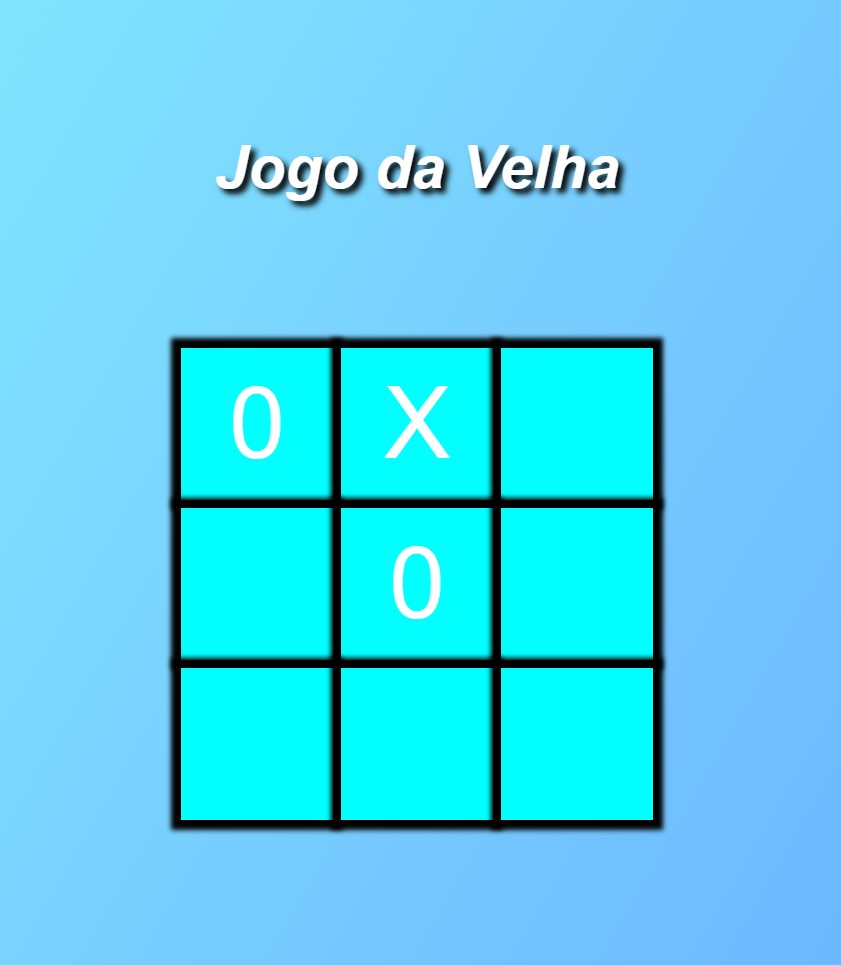

# Jogo da Velha

## Tela Inicial

Nessa tela é idenficado os jogadores que participarão do jogo.

## Tela do Jogo

Essa é a forma que os usuários irão jogar.

## Tela do Vencedor

O jogo irá identificar o vencedor e mostrará na tela.

## Tela de Empate

Caso termine as jogadas e nenhum jogador saia vencedor, é identificado que houve um empate.

